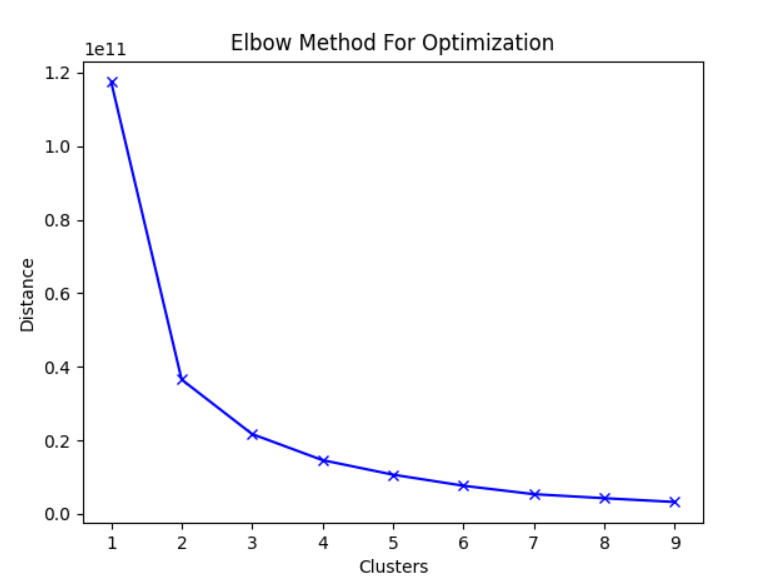
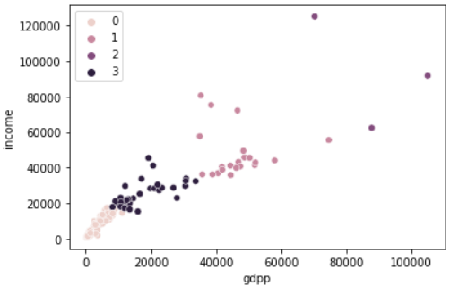

# Unsupervised learning for country grouping

HELP International is a humanitarian ONG committed to combating poverty and providing basic needs to the poorest countries in situations of calamity and natural disasters.

The data used in this problem was taken from Kaggle. Follow the link: https://www.kaggle.com/rohan0301/unsupervised-learning-on-country-data

### _The Problem_

HELP International raised about $10 million. And in order to use this money strategically and effectively, the ONG's CEO must make his decision in choosing the countries most in need, through the help of Data Science resources.

In this problem, the Elbow Method and KMeans were applied.

 

With the help of the seaborn library and the scatterplot function, the cluster with the lowest gdpp and income can be observed.

 

### _The chosen countries_

For more efficient targeting of the amount, countries that have an income of less than 1000 were chosen. With that the chosen countries were: Burundi, Central African Republic, Congo, Dem. Rep., Liberia, Mozambique and Niger.